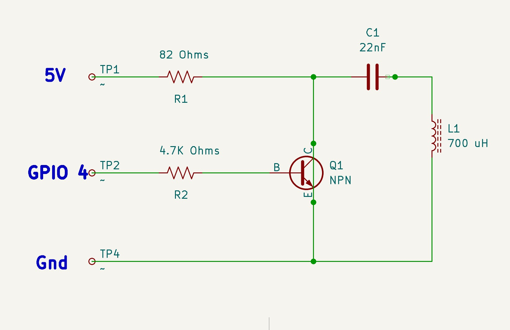

# time-signal
A multiband time signal radio transmitter for Raspberry Pi.

**time-signal** allows to convert a Raspberry Pi to a radio time server using using either JJY, MSF, WWVB or DCF77 protocol, allowing to automatically adjust time on radio-controlled watch or clock. 

## Platforms

**time-signal** has been succesfully tested on :
* Raspberry Pi Zero W
* Raspberry Pi 3 Model B Rev 1.2
* Raspberry Pi 4 Model B Rev 1.1

## Build

Inside the directory where the source files are, simply type `make`

## Usage

```
sudo ./time-signal [OPTIONS]
```
### Options

-s <service> :  Time service: either of DCF77, WWVB, JJY40, JJY60, MSF

-v : Verbose. Show modulation enveloppe.

-c : Send carrier wave only, without time signal. Usefull for testing frequencies.

-h : This help.

## Hardware

### Circuits

**time-signal** uses GPIO 4 (pin 7) to transmit the modulated carrier wave and a Ground pin. 5V power pin could also be used by your circuit if you want to amplify the signal.


_[Raspberry Pi pinout](https://pinout.xyz)_

The simplest hardware you can use to transmit the signal is to connect a coil and a 220Ω resistor in serie between GPIO4 and a ground pin :


Here with a 60cm wire and 14 turns of 13mm diameter, the range is quite decent : 10cm for DCF77 and 45cm for JJY at 40 kHz. 

For a longer range and still simple circuit, you can use a ferrite antenna salvaged from an AM receiver with a N mosfet as amplifier. You'll then have this 3 components + antenna circuit :


_The hairy 3 components circuit_

If you don't have a mosfet, you can use a NPN transistor instead with a 4.7K resistor between its base and GPIO4.



C1 capacitor value depends on antenna inductance and target frequency (see below).

As small mosfets like BS270 can handle up to 250 mA, you can design a more powerful transmitter with two complementary mosfets as a NOT gate and a lower value resistor :


I successfully tested these circuits with JJY40 et DCF77 signals and reached a range of ten meters with JJY40 and the dual mosfet configuration.


_G-Shock strong reception (L3)_

# Antennas

There is much concern in radio communities about strength of the signal related to legal limits. But with low frequencies, it is very difficult to design a long range transmitting antenna :

"The problem of designing compact, efficient, and broadband antennas capable of transmitting signals in the very low frequency (VLF, 3-30 kHz) and low frequency (LF, 30-300 kHz) bands has plagued engineers for decades [...] For instance, attempting to build a standard quarter-wave monopole at 30 kHz would require an antenna to be 2.5 km long, which is roughly three times longer than the tallest building on Earth"(1)

For example, the [Ohtakadoyayama station](https://jjy.nict.go.jp/jjy/trans/index-e.html) antenna transmitting JJY 40 kHz signal is an umbrella type 250m high, and the [Mainflingen station](https://www.ptb.de/cms/en/ptb/fachabteilungen/abt4/fb-44/ag-442/dissemination-of-legal-time/dcf77/dcf77-transmitting-facilities.html) transmitting DCF77 at 77.5 kHz is a T-type 150m high.

So building an efficient transmitting antenna is far beyond practical limits for the hobbyist. The solution here is to use a compact ferrite rod antenna. These ones can be salvaged from an AM Radio, as there is no longer AM broadcasting, or from a cheap DCF77 module. But "ferrite rod antennas are normally only used for receiving. They are rarely used for transmitting anything above low levels of power in view of their poor efficiency. They can be used as a very compact form of transmitting antenna for applications where efficiency is not an issue and where power levels are very low. If power levels rise too high then heat dissipation in the ferrite becomes an issue"(2).

Hence don't expect to transmit outside your house. The longest range I succeeded to reach is 10 meters with a 40 kHz signal, with direct line of sight. The antenna was powered by the 5 V dual mosfet amplifier circuit. Increasing the voltage didn't improve the range. 

You'll have to adjust the resonance of your antenna for the requested frequency, with the capacitor. Capacitor value depends on antenna inductance L and target frequency f :

C = 1 / (4×π²×L×f²)`

AM antennas have usually an inductance between 500 and 700 µH, so the theoretical C values are :

* 40000 Hz : 26 nF
* 60000 Hz : 12 nF
* 77500 Hz :  7 nF

If you have an oscilloscope, connect it between the antenna and the capacitor, run time-signal with '-c' option and change the value of the capacitor to obtain the larger and cleaner signal, that is a nice sinusoid.

| Poorly tuned antenna (40kHz, 10nF) | Quite well tuned antenna (40kHz, 33nF) |
| --- | --- |
|  |  |

# Credits and references

Large parts of time-signal code come from Henner Zeller [txtempus](https://github.com/hzeller/txtempus). The main differences between time-signal and txtempus are :

* txtempus works on Raspberry Pi 3 and Zero W and Jetson Nano ; time-signal works on Raspberry Pi 3, 4 and Zero W.
* txtempus is written in C++ while time-signal is written in C and doesn't need CMake to be built.
* time-signal doesn't use an attenuation pin, so the required hardware is simpler.

Some useful references :

1. New ideas about designing low frequencies antennas : Slevin, Cohen and Golkowski (2021), "Wideband VLF/LF Transmission from an Electrically-Small Antenna by Means of Time-Varying Non-Reciprocity via High-Speed Switches", URSI GASS 2021, Rome, Italy, 28 August - 4 September 2021.
2. Ferrite antennas : https://www.electronics-notes.com/articles/antennas-propagation/ferrite-rod-bar-antenna/basics-tutorial.php
3. Discussion in txtempus github about how to design longest range transmitters : https://github.com/hzeller/txtempus/issues/8
4. Andreas Spiess video about designing a DCF77 transmitter : https://youtu.be/6SHGAEhnsYk
5. Wikipedia pages about time services : [DCF77](https://en.wikipedia.org/wiki/DCF77), [WWVB](https://en.wikipedia.org/wiki/WWVB), [MSF](https://en.wikipedia.org/wiki/Time_from_NPL_(MSF)), [JJY](https://en.wikipedia.org/wiki/JJY).
